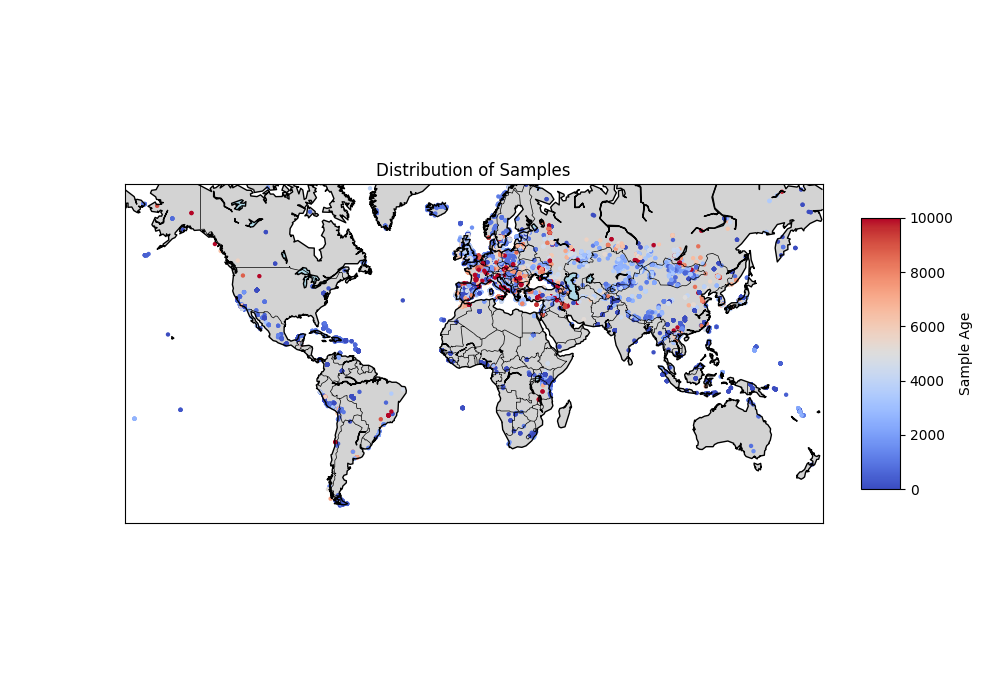
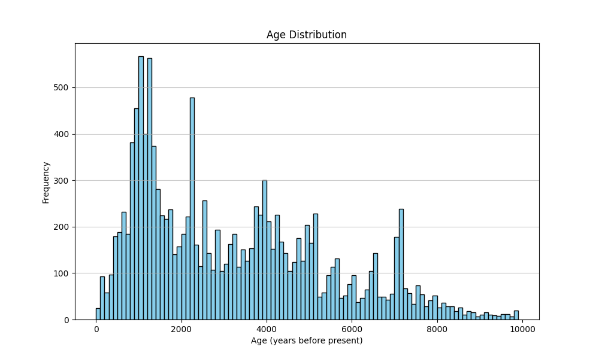

# Visualizing Ancient DNA

## Introduction

This project utilizes basic neural network architectures to
analyze ancient DNA data sourced from the
[Allen Ancient DNA Resource](https://reich.hms.harvard.edu/allen-ancient-dna-resource-aadr-downloadable-genotypes-present-day-and-ancient-dna-data) version 62.0.
Our primary objective is to create a visual representation—a movie—that illustrates how different genetic variants have
spread and evolved across Europe and Eurasia over time. The aim is to gain an exploratory understanding of genetic
variation in ancient DNA and its change over time.

## Data

The data for this project was sourced from the Allen Ancient DNA Repository and converted to ZARR variant calls using
the following [scripts](https://github.com/davidmoser/adna_retrieval_conversion). The age of the sampled individuals
ranges from contemporary to a hundred thousand years ago.
To concentrate on the bulk of the ancient data it was filtered from 100 year old samples to 10'000 year old samples,
resulting in 13'208 individuals used for learning.

For each individual there are 1.2 million variant calls. Some runs were made on the entire set of calls, random
fractions,
and a subset of 9'190 variant calls filtered with the `allel.locate_unlinked` method. Since the results on the filtered
set were similar to the entire set on the Genonet only the filtered set was used in the training of the other two
networks.

## Genonet

This fully connected neural network takes variant calls as input and outputs the corresponding location and age.
It consists of a first layer mapping the input to the hidden dimension, then several layers each mapping to the same
hidden dimension
and then a final layer mapping to the three dimensional label space.

The variant calls (-2 for undetermined, 0 for homzygous reference, 1 for heterozygous, 2 for homozygous alternative)
were one hot encoded giving an input dimension of 36'760. The hyperparameters were optimized with hidden dimension 150
and 10 hidden layers.
These dimensions were then reused for the other two networks.

The results did not generalize well, with errors ranging up to 20 degrees for location and up to 30% for age. This is
probably due to the limited size of the dataset. As the dataset grows, errors are expected to be lower. For an
exploratory analysis of the existing set it makes sense to overlearn, which gives much smaller errors of up to 5 degrees
for location and up to 5% for age.

## Inverse Genonet

The Inverse Genonet performs the opposite task of the Genonet. This model is used to predict variant calls for
any given location and age. It has the same architecture as the Genonet, but maps the 3 input dimensions of
location and age onto the 36'760 dimensions of the variant call space. We used the best hyperparameters of the
Genonet, hidden dimension 150 and 10 hidden layers.

## Autoencoder

This is a fully connected autoencoder that maps the variant call space to a three dimensional latent space
and then back up to the variant call space. It is an extension of the principal component analysis, allowing for some
non-linear decomposition. We use the latent embedding as a colormap for the visualization of variant calls.

## Creating a movie

By combining the output of the Inverse Genonet and the Autoencoder, we have produced a movie that visualizes the spread
of different genetic variants across Europe and Eurasia over time. Due to the high concentration of data from Europe,
this region provides the most detailed and interesting visualizations.

The movie reveals some distinct moving boundaries between genetic variants, while other areas display gradual geographic
transitions.
These moving boundaries might indicate population expansions or migrations. In other instances, we observe color shifts
without the
movement of boundaries, which might suggest the mixing of populations.

As this project is exploratory, it is important to note that the accuracy of predictions for different locations and
times is challenging to determine, and the results should be interpreted as an inspiration for further research.

Click on the image to open the video in Youtube.

## Conclusion

This project explores the use of deep learning to analyze ancient DNA data from the Allen Ancient DNA Repository. By
developing and applying basic deep learning architectures, including the Genonet, Inverse Genonet, and Autoencoder, we
have created a visual representation that illustrates the spread and change of genetic variants
across Europe and Eurasia over time. The resulting movie provides a glimpse into our genetic history,
highlighting patterns of migration and population mixing.

## Further Work

### Clustering

Enhancing the analysis by clustering populations in the latent space and determining the most informative variants could
provide more precise information about the genetic variants displayed, improving the interpretability of the results.

### Revisiting the Analysis

As more ancient DNA samples become available, revisiting this analysis will enhance its accuracy and information
content, offering deeper insights into ancient human populations.

### Predicting distributions of variants

The Inverse Genonet only predicts a single set of variant calls for each location and time. In reality this is a
distribution. The architecture could be extended to take this into account.